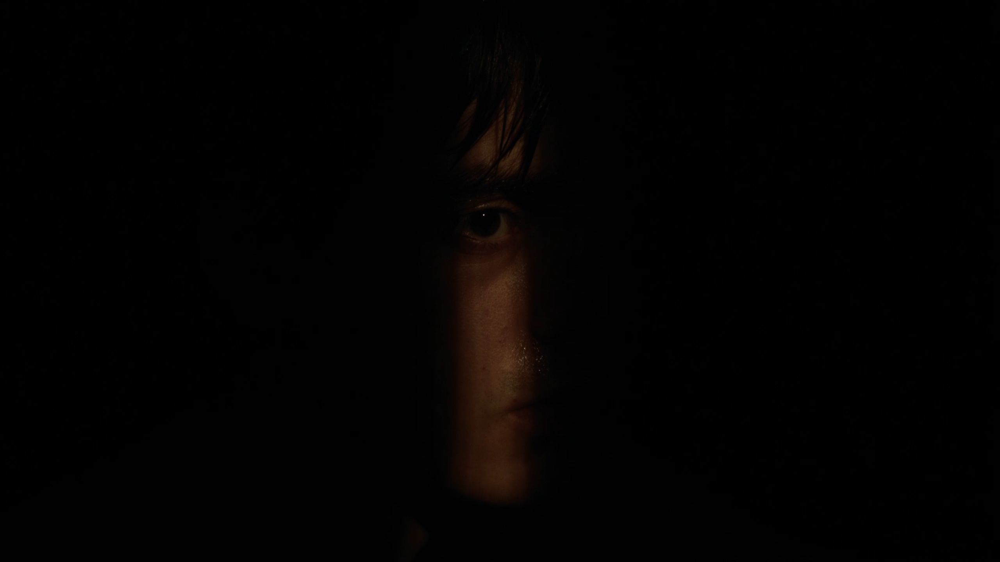
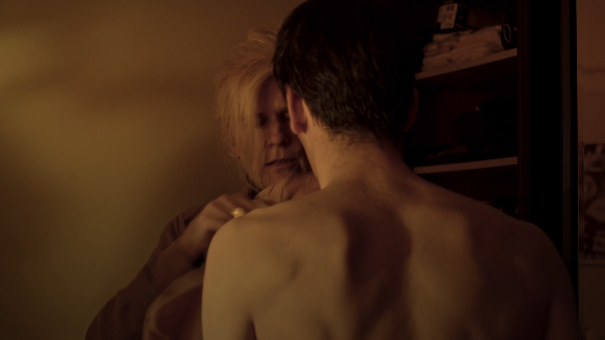

_De Date_ is a short film I played in in 2022 by Mon Dewulf, a KASK Film student. It's a short about a young adult, let's call him Thomas (I don't recall him having an actual name). Thomas is a young, vulnerable gay guy who likes going out on dates with older men, which often goes wrong in some kind of way. Tonight was one one of those nights, on this date we find out something has gone catastrophically wrong and we see this play out, mostly through his mothers eyes, as she comes to the rescue to get Thomas out of the mess he has once again gotten himself into.

